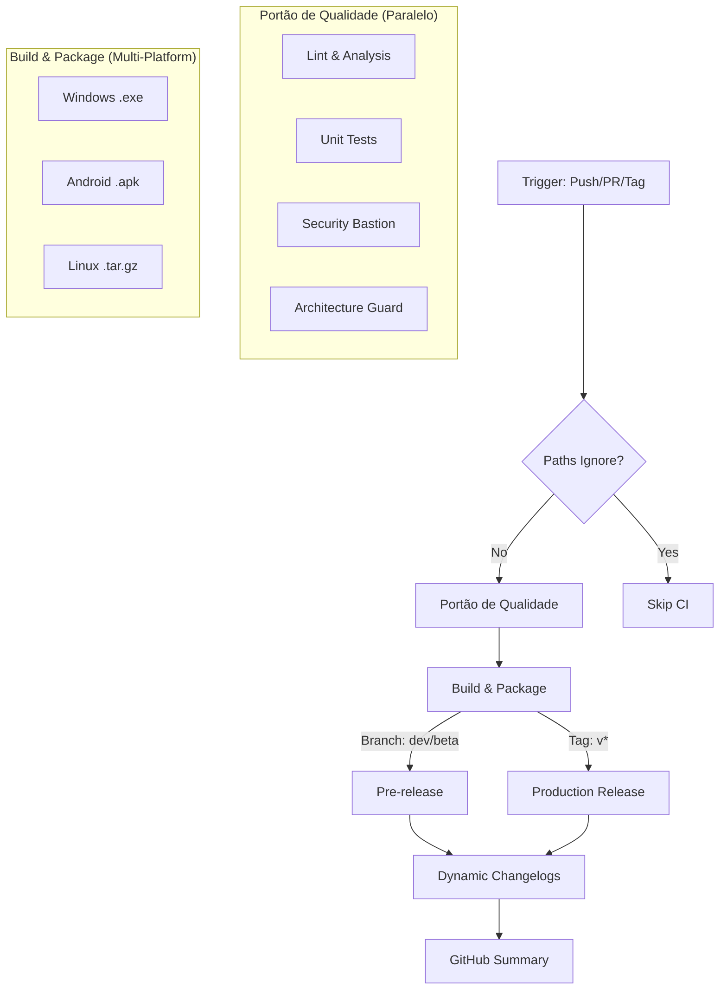

# Hermes' Journal 📦

Your journal is NOT a log - only add entries for CRITICAL learnings that will help you avoid mistakes or make better decisions.

## Visual Chronology: The Masterwork Pipeline 🗺️

## 2026-01-04 - Pipeline Speed Breakthrough **Pipeline:** Total build time was peaking at 12 minutes due to sequential Android/Linux builds and redundant disk cleanup operations. **Automation:** Parallelized the Linux/Android jobs and removed the `Free up disk space` step which was a silent time-sink (1.5 min per job). **Velocity:** Saved ~4 minutes per push (33% speedup)

## 2026-01-04 - Turbo Caching & Format Gates **Pipeline:** Cold `flutter pub get` was adding overhead to every job across multiple platforms. **Automation:** Implemented universal `actions/cache` for `.pub-cache` (Linux) and `AppData\Local\Pub\Cache` (Windows) keyed by `pubspec.lock`. Added `flutter format` check to ensure the "path to production" remains pristine. **Velocity:** Expecting another 1-2 minutes saved on repeat runs by avoiding redundant dependency downloads

## 2026-01-04 - Visual Pulse & Gradle Glide **Pipeline:** Build artifacts were "black boxes" until downloaded, and Android native setup was repetitive. **Automation:** Enabled `GRADLE_CACHE` via `setup-java` and manual `actions/cache` for Gradle wrappers. Implemented `GITHUB_STEP_SUMMARY` to surface versioning, sizes, and health checks directly on the GitHub Dashboard. **Velocity:** Android builds expected to be ~1-1.5 minutes faster on warm caches. Improved team visibility during releases

## 2026-01-04 - Release Intelligence **Pipeline:** Release notes for Dev/Beta were static or non-existent, leaving users/testers in the dark about what changed. **Automation:** Injected `git log` parsing into `prerelease.yml` to generate dynamic changelogs and enabled `generate_release_notes` in the production pipeline. Unified build metadata injection. **Velocity:** Automation of release documentation saves ~5-10 minutes of manual writing per version and reduces communication friction

## 2026-01-04 - Quality Intelligence & Hygiene **Pipeline:** Quality metrics (tests/coverage) and dependency health were hidden in logs, requiring manual digging. **Automation:** Implemented `Quality Gate Evidence` and `Dependency Hygiene` summaries in `quality-gate.yml` using `GITHUB_STEP_SUMMARY`. Added automated `flutter pub outdated` auditing. **Velocity:** Instant visual evidence of build health saves developer review time and prevents "dependency decay" from reaching production

## 2026-01-04 - Stewardship & Dual Artifacts **Pipeline:** Evaluated artifact needs and solidified a dual-delivery strategy. **Automation:** Implemented `paths-ignore` for documentation. Configured `build-and-package.yml` to build and upload both APK and AAB for official releases. **Velocity:** Automated store-readiness and direct-install options generated simultaneously ensure official releases are 100% versatile out of the box

## 2026-01-04 - Granular Feedback & Eternal Freshness **Pipeline:** Quality checks were monolithic, delaying feedback. Dependencies were manually managed. **Automation:** Split `quality-gate.yml` into parallel `lint` and `test` jobs. Implemented `.github/dependabot.yml` for automated Actions/Pub updates. Hardened workflows with `timeout-minutes`. **Velocity:** Fast styling feedback in <2 mins (3x speedup for lint results). Automated maintenance reduces manual toil for dependency updates

## 2026-01-04 - Governance & The Sentinel **Pipeline:** PRs were untagged, and debug residuals (prints) were reaching development branches. **Automation:** Implemented `labeler.yml` for automated area/type categorization and `label.yml` workflow. Escalated `avoid_print` to a hard ERROR in `analysis_options.yaml`. **Velocity:** Automated governance reduces maintainer overhead. Strict lints act as a "Sentinel," preventing silent technical debt from entering the code history

## 2026-01-04 - Chronometry & Performance Guard **Pipeline:** Binary bloat and performance regressions were difficult to track without historical data. **Automation:** Implemented machine-readable metadata export in `build-and-package.yml` for "Hermes' Chronometer". Hardened `analysis_options.yaml` with performance-centric rules (const widgets, key usage). **Velocity:** Automated telemetry provides a foundation for performance regression tracking. Strict lints ensure the UI remains smooth (60FPS) by enforcing best practices at the compiler level

## 2026-01-04 - The Herald & The Bastion (Round 10) **Pipeline:** Feedback loops required manual checking of "Jobs summaries," and security scans were non-existent. **Automation:** Implemented `pr-proclamation` job using `gh pr comment` for instant PR feedback. Established `Security Bastion` in `quality-gate.yml` to detect leaked credentials via regex scanning. **Velocity:** Developers receive unified quality results directly on their PRs in <3 mins. Security posture is significantly hardened by catching leaks before they reach the main history

## 2026-01-04 - The Vanguard's Beacon (Round 11) **Pipeline:** Structural decay (large files) was going unnoticed, and the complex workflow lacked a visual map. **Automation:** Implemented `Architecture Guard` in `quality-gate.yml` to detect files > 600 lines. Added `Mermaid` visualization to the Journal. Refined `concurrency` to protect tag-based releases. **Velocity:** Automated structural auditing prevents "The God Object" smell from entering the codebase. Visual chronology reduces onboarding time for new DevOps contributors

## 2026-01-04 - The Watchtower & Local Sentinel (Round 12) **Pipeline:** CI reliability was only tested on push, and the feedback loop for developers was minutes long. **Automation:** Implemented `schedule` triggers (The Watchtower) for daily health checks. Created `hermes_gate.ps1/sh` (The Sentinel) for local Quality Gate parity. Enabled Gradle parallel execution. **Velocity:** Developers can now verify code in seconds locally before pushing. Scheduled builds ensure the project remains "Green" even with external dependency changes

## 2026-01-04 - The Alchemist & The Shield (Round 13) **Pipeline:** Indirect dependencies were a "black box" and Manifest security was manual. **Automation:** Implemented `The Inventory` (automated `dependency_tree.txt` export) and `The Shield` (automated Android Manifest security auditing). Confirmed `Binary Transmutation` (isMinifyEnabled/isShrinkResources) for production. **Velocity:** Total transparency of the dependency graph prevents "dependency bloat". Automated security scans catch infrastructure-level vulnerabilities before they reach the artifact stage

## 2026-01-04 - The Cartographer & The Sentinel (Round 14) **Pipeline:** Binary footprint was opaque, and code style lacked concise enforcement. **Automation:** Implemented `Size Cartography` (automated `flutter build apk --analyze-size`) to surface top contributors in `GITHUB_STEP_SUMMARY`. Hardened `analysis_options.yaml` with "Sentinel's Reach" lints (expression bodies, explicit overrides). **Velocity:** Real-time visibility into asset/library weight prevents silent binary bloat. Stricter lints ensure the codebase remains concise and modern, reducing maintainer cognitive load

## 2026-01-04 - The Harbinger & The Librarian (Round 15) **Pipeline:** Historical trends were manual and regressions were only visible if someone looked at the logs. **Automation:** Implemented `The Librarian's Index` (automated JSON archival to `coverage-data` branch) and `The Harbinger's Vigil` (automated size delta tracking). The CI now fetches the previous baseline and alerts if the binary grows by >100KB. **Velocity:** Automated governance ensures the project never "surprises" the user with sudden bloat. Historical visibility enables long-term performance optimization without manual spreadsheet tracking

## 2026-01-04 - The Scribe & The Ghost Hunter (Round 16) **Pipeline:** Historical data was static, and test suite performance was an unmonitored "black box". **Automation:** Implemented `The Scribe's Chronology` (automated Mermaid trend charts in `coverage-data` README) and `The Ghost Hunter's Lantern` (automated test performance auditing). The CI now identifies the Top 5 slowest tests and provides a visual dashboard of technical debt. **Velocity:** Automated auditing prevents "test suite rot," saving minutes of CI time in the long run. Visual trends enable faster high-level engineering decisions by surfacing patterns in binary size and coverage
